# crkbd trackpoint

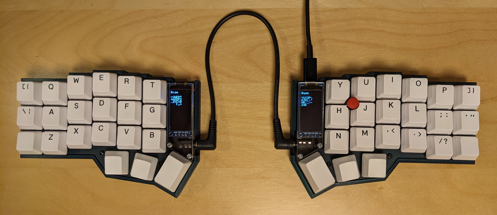

I added a trackpoint to a [corne-cherry](https://github.com/foostan/crkbd) (crkbd) keyboard for ergonomic pointing bliss.

The trackpoint is mounted in the middle of the YUHJ keys for easy access from the home row.
Luckily, the corne-cherry PCB has a mounting hole at this exact location, which we repurpose for the trackpoint.

## Hardware
- [corne-cherry kit](https://github.com/foostan/crkbd)
- [Sprintek SK8707 trackpoint module](https://www.sprintek.com/en/products/pointing_stick/SK8707-06.aspx)
- Suitable trackpoint stem
- RP2040 controller, e.g., [SparkFun Pro Micro - RP2040](https://www.sparkfun.com/products/18288) or [Adafruit KB2040](https://www.adafruit.com/product/5302)
- 64x128 OLED module (SH1107)
- 3D-printed case, switch plates, tenting legs (optional) and wrist rest (optional)
- Keycaps

### SK8707 trackpoint module
Can be ordered directly from Sprintek by [sending them an email](https://www.sprintek.com/en/order/Order.aspx).
There is a 5V and 3.3V version.
Get the 3.3V version to be compatible with the RP2040.
I accidentally ordered the 5V version, so I had to bypass the 5V regulator and hooked up 3.3V from the RP2040 to Vout on the board (see photo below).

I desoldered the ribbon cable from the controller board, and wired up only the four wires needed:
- Pin 1: PS/2 data line (blue)
- Pin 6: PS/2 clock line (white)
- Pin 7: GND (black)
- Pin 8: 3.3V (red, if you got the 3.3V version)
- Vout: 3.3V (red, if you got the 5V version)

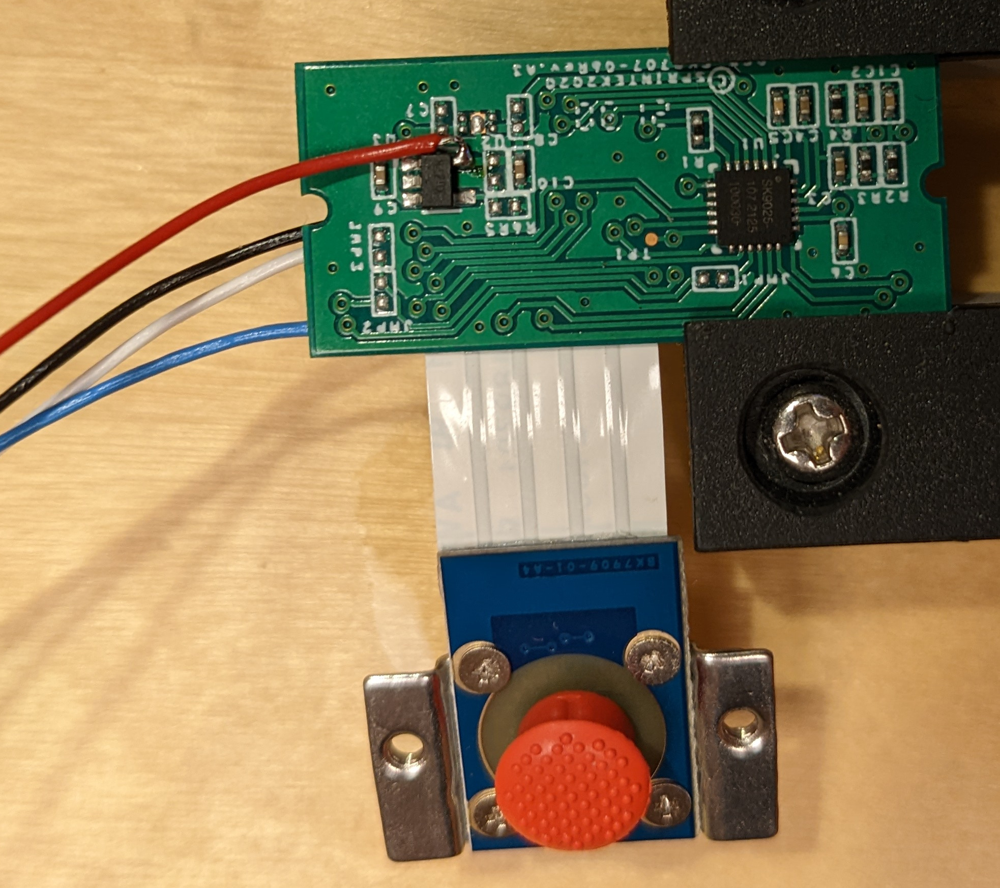

SK8707 does not require a reset circuit, but it does need pullups on the PS/2 data and clock lines. We can enable pullups on the RP2040 controller, so no extra resistors are needed.

I was lucky to have a trackpoint stem from a decommissioned Tex Yoda II, but others report success using a [labret cheek piercing](https://github.com/alonswartz/trackpoint#q-what-should-i-use-for-the-trackpoint-stemstick).

### RP2040 controller
At first I tried using an AVR-based controller (Elite C with ATMega32U4).
The crkbd occupies the USART pin (D2) for soft serial, so we're stuck with QMKs PS/2 interrupt mode (unless we hack the PCB).
Unfortunately, I found that quite frequently PS/2 packets would arrive with parity errors.
After some investigation, I was able to track it down to [QMK interrupts sometimes being delayed and missing the PS/2 clock altogether](https://www.reddit.com/r/olkb/comments/xppdsz/ps2_interrupt_delays_on_avr/).

Instead of hacking the PCB, it's much easier to upgrade the controller.
This also leaves ample room for other features.
There are several options that are pin-compatible with the Pro Micro.
The RP2040-based boards are not only powerful, but come with Programmable IO (PIO) hardware blocks.
PIO enables protocols such as PS/2 to be implemented in hardware, offloading the main processor for more important work.
A PS/2 PIO driver is now available in QMK (developed by @gamelaster and myself, see [PR #17893](https://github.com/qmk/qmk_firmware/pull/17893)).

Make the following connections from the SK8707:
* PS/2 data line: connect to B4 on the RP2040
* PS/2 clock line: connect to B5 on the RP2040
* 3.3V and GND are readily available from the OLED header

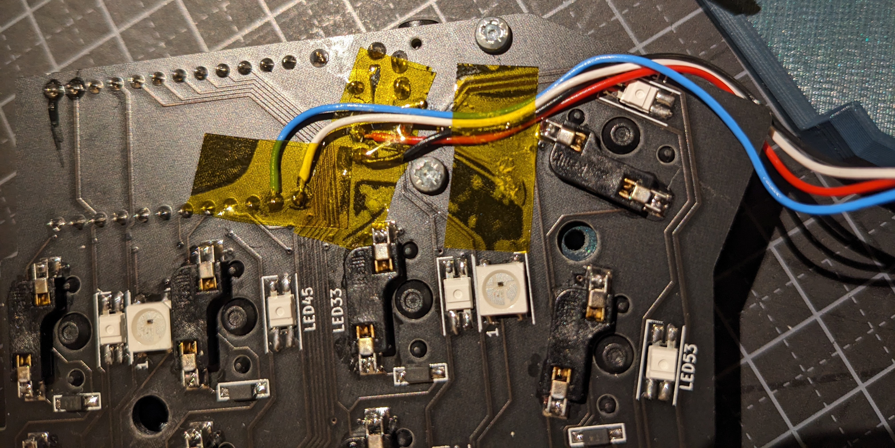

### 64x128 OLED module (SH1107)

While not directly related to the trackpoint, I upgraded to larger 64x128 OLED modules (SH1107).
These are wide enough so that the entire keymap can be displayed (reflecting the current layer), which is extremely handy.
I also use them to display the current trackpoint sensitivity.
Search AliExpress and you will find plenty of options.

### 3D-printed case

To mount the trackpoint, I designed a 3D-printed case based on the [Travel Crkbd magnetic case by taksi_kavausuki](https://www.printables.com/model/117598-travel-crkbd-magnetic-case).
There is one version of the case without trackpoint (for the left half) and one version with the trackpoint mount (for the right half).
The switch plates are remixed from [Corne Keyboard HiPro Case by mburrows](https://www.thingiverse.com/thing:3652379).

STLs and sources can be found under `STLs/` and `sources/`, respectively.

Some notable features:
* Trackpoint mount (for the right half)
* Insets for 8mm anti-slip pads
* Attachable tenting legs (optional)
* Attachable wrist rests (optional)

STLs:
* `Case_Trackpoint.stl`: Case with trackpoint mount (right half)
* `Case_Normal.stl`: Case without trackpoint mount (left half)
* `Switch_Plate_Trackpoint.stl`: Switch plate for trackpoint
* `Switch_Plate_Normal.stl`: Switch plate without trackpoint
* `Wrist_Rest.stl`: Wrist rest (optional)
* `Leg_50mm.stl` and `Leg_42_5mm.stl`: Tenting legs (optional)

#### Required hardware
* 9x M2 heated inserts
* 9x M2x10 screws
* 2x M2x4 screws
* 2x M2 nuts
* 8x M3nS square nuts (tenting legs and wrist rests)
* 10x M3x10 screws (tenting legs and wrist rests)
* 2x M3 heated inserts (tenting legs on wrist rests)
* 8mm anti-slip pads

#### Printing instructions
Print the parts in your favorite material.
I used PLA with 0.15mm layer height, 4 perimeters and 15% infill.

`Case_Trackpoint.stl` should be printed with supports below the trackpoint mount (add a support enforcer modifier).
For `Wrist_Rest.stl`, add some extra infill around the heated insert (add an infill modifier).

**NB: The parts are all oriented for the left half, so to print the right halves simply mirror each part accordingly in the slicer.**

#### License

The 3D-printed files are licensed under [CC BY-NC-SA 4.0](https://creativecommons.org/licenses/by-nc-sa/4.0/)

### Assembly

The instructions below are for the trackpoint version of the case.

Using a soldering iron, insert the M2 heated inserts into the case:

If you would like to use tenting legs, insert M3ns square nuts in the two slots on the left side inside the case.
If you plan on attaching wrist rests, insert M3ns square nuts in the two slots on the bottom side inside the case.
Tip: Use a M3 screw to pull the nuts in.

Turn the case over and insert two M2 nuts for mounting the trackpoint:

In the above photo you can see the insets for the anti-slip pads.
Attach as many as appropriate (if tenting, you only need pads along the outer edge).

Attach the SK8707 trackpoint module with two M2x4 screws:
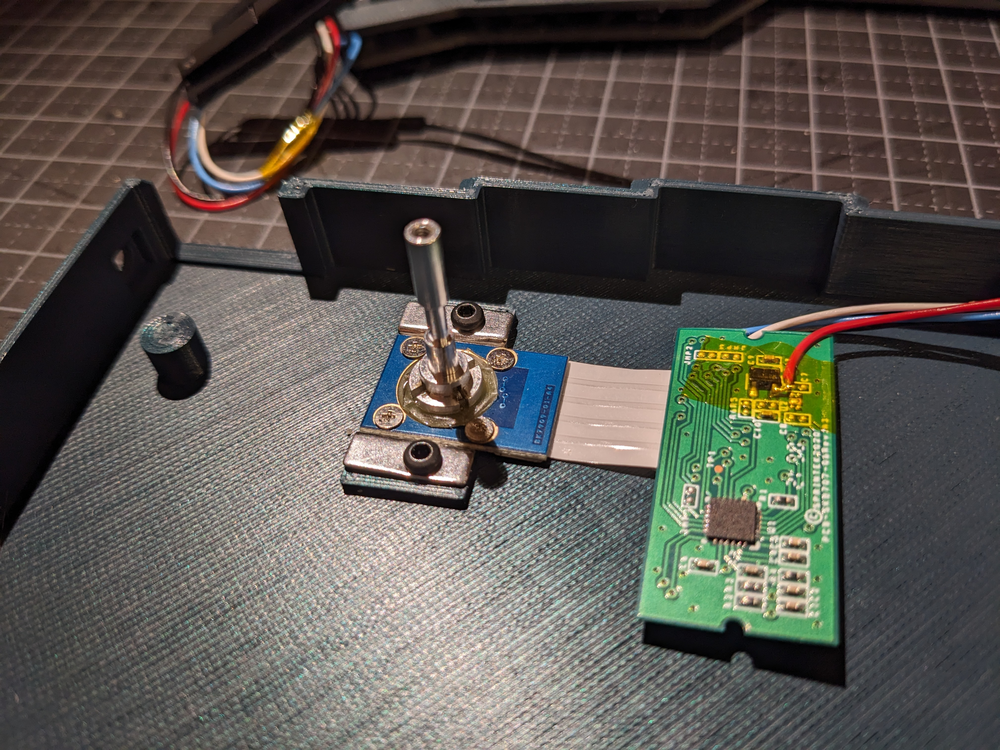

Attach the SK8707 PCB with double-sided tape, and route the wires as follows:

Insert the crkbd PCB with the 3D-printed switch plate and attach with four M2x10 screws.
Make sure the trackpoint wires are not pinched!
Note: the PCB switch plate and bottom plate that come with the corne cherry kit are not used.

The YUHJ keycaps must be modified to make room for the trackpoint stem (see below for jig).
Here the stem sports a 3D-printed adapter for the trackpoint cap.
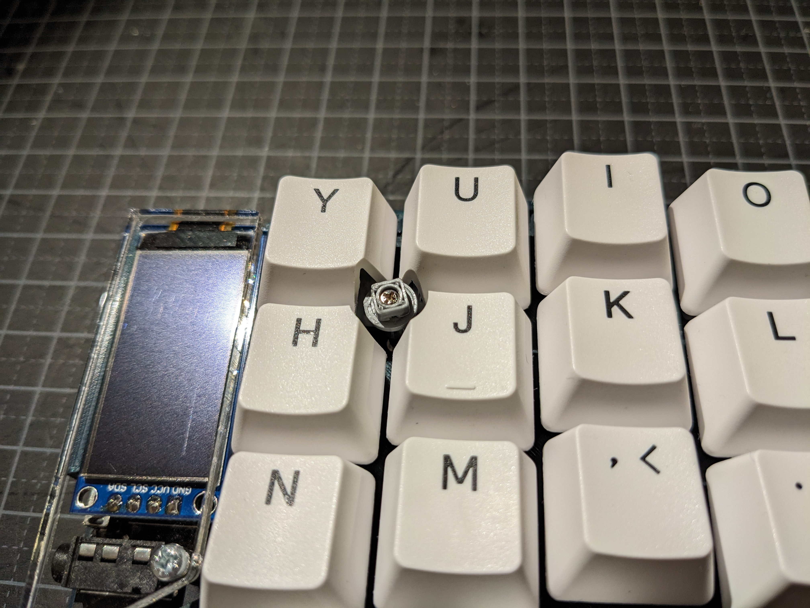

With the cap it looks rather neat:
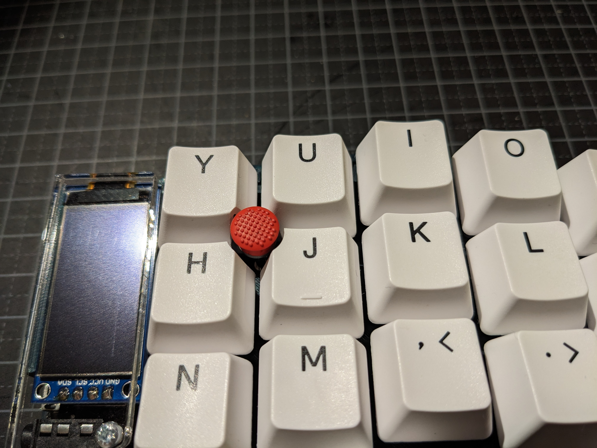

The finished product:
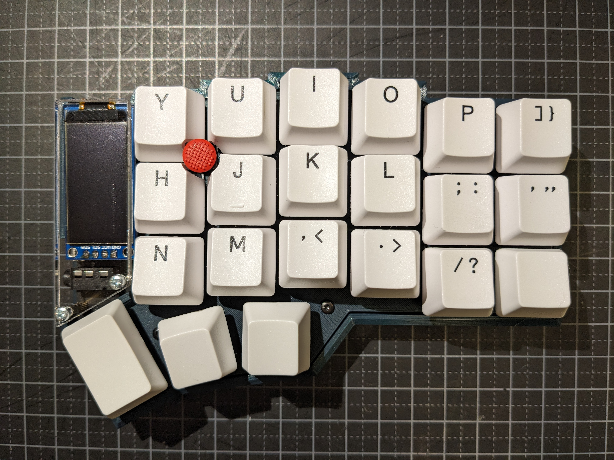

Repeat the above process for the other half (excluding the trackpoint, of course).

Tenting legs can be customized to any height in OpenSCAD, and attach to the side of the keyboard:
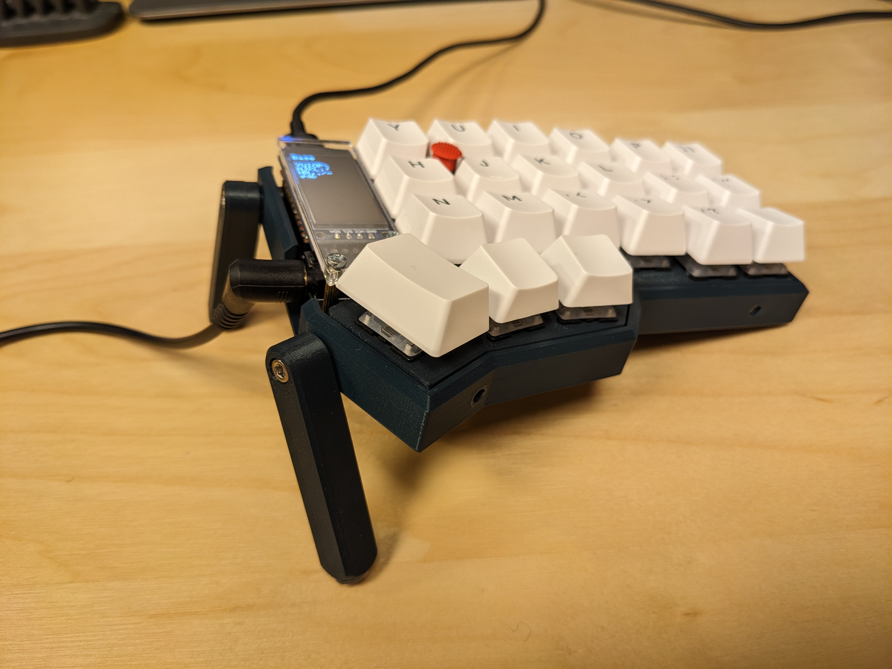

Using the trackpoint is most comfortable using a wrist rest.
The wrist rest also helps prevent the keyboard from being pushed across the desk while using the trackpoint.
For comfort, I attached some 5mm neoprene pads.
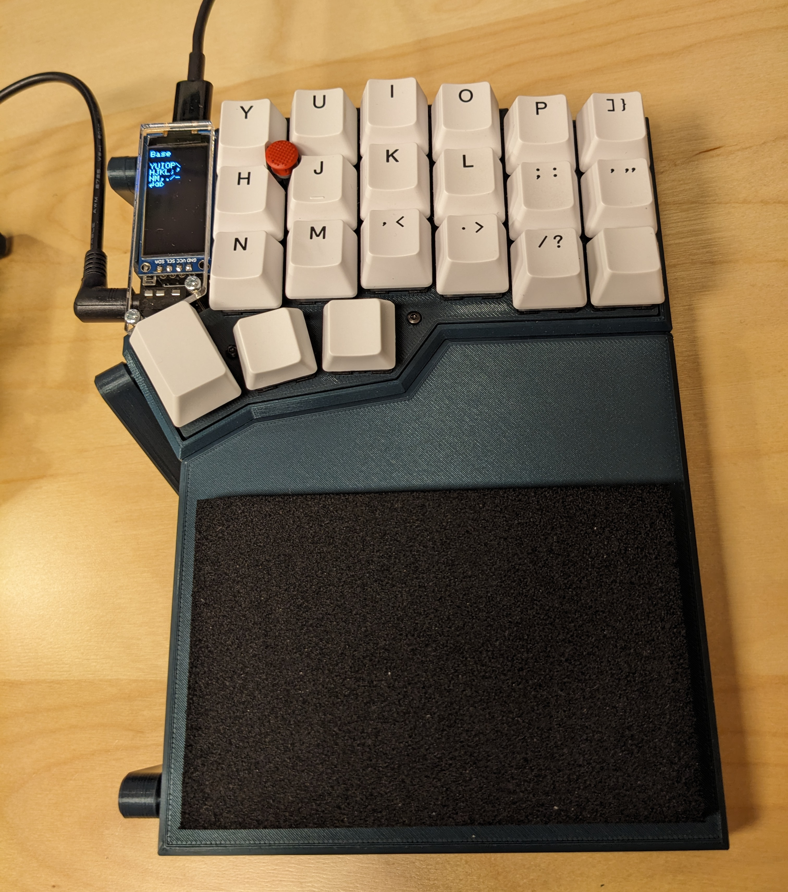

Both halves with wrist rests and tenting:
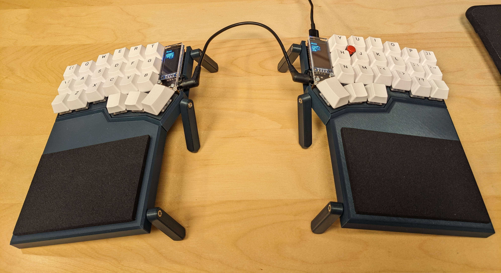

### YUHJ drilling jig

There is also a 3D-printable jig available for help modifying the YUHJ keycaps to accomodate the trackpoint.
Place the YUHJ keys between the top and bottom plate, and fasten the plates together with some screws.
Then use the hole as a guide to file / Dremel away a small part of each key.

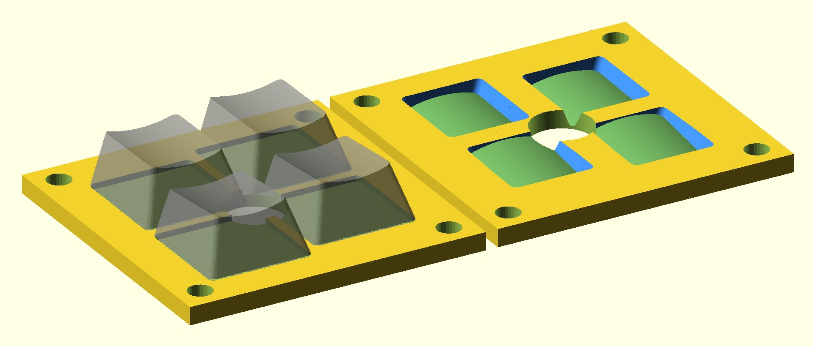

STLs:
* `YUHJ_Drilling_Jig_Bottom.stl`
* `YUHJ_Drilling_Jig_Top.stl`

The jig can be customized for different keycap profiles, see `YUHJ_Drilling_Jig.scad`.

### Firmware
Please see my [qmk branch](https://github.com/joh/qmk_firmware/tree/joh-rp2040-trackpoint-pio-v4/keyboards/crkbd/keymaps/joh) for details on how to configure QMK.

Some notable features:
* `MH_AUTO_MOUSE_BUTTONS` from manna-harbour is used to automatically switch to the mouse layer when the trackpoint is used.
* Pullups are enabled on the PS2 CLK/DATA pins
* Custom keys for controlling trackpoint sensitivity

## Other resources
This project was largely inspired by manna-harbours [crkbd hotstwap trackpoint](https://github.com/manna-harbour/crkbd).
Other good sources of information:
* [jorne trackpoint](https://github.com/joric/jorne/wiki/Trackpoint)
* [How to integrate a trackpoint in a mechanical keyboard by alonswartz](https://github.com/alonswartz/trackpoint)
* [TPS42 keyboard](https://kbd.news/TPS42-1711.html)
